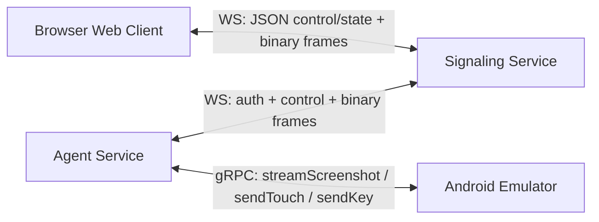
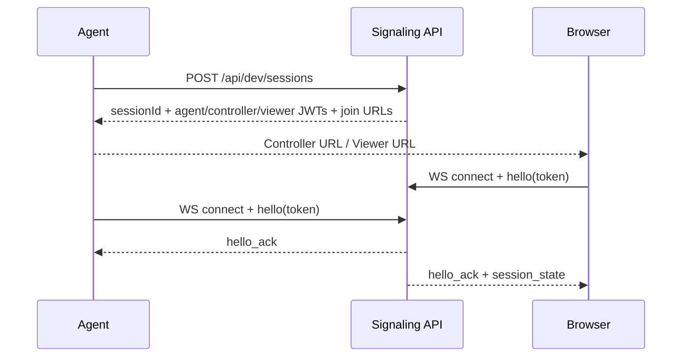
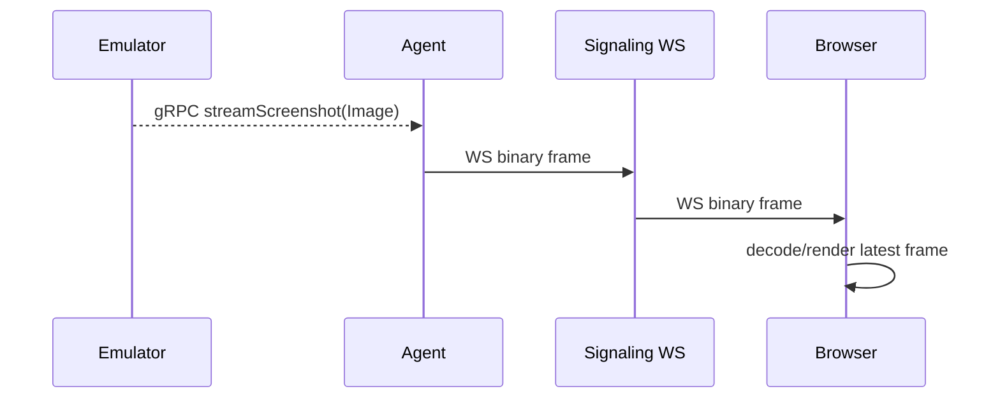
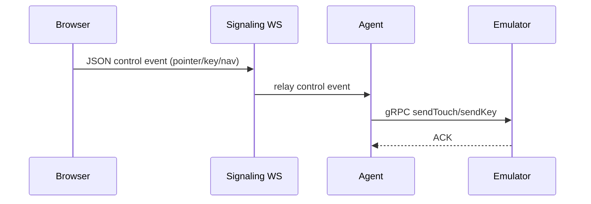
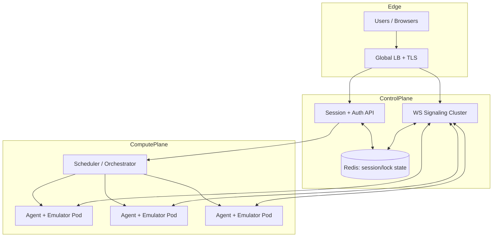

# Android Web Mirror

Android emulator mirroring + control in a browser (local-first POC).

This project runs 3 local processes:
1. `signaling`: session tokens, lock arbitration, WebSocket relay.
2. `agent`: captures emulator frames from Android Emulator gRPC (`streamScreenshot`) and injects controls via gRPC (`sendTouch` / `sendKey`).
3. `web`: browser UI for viewing and controlling the emulator.

## Prerequisites

- Node.js 20+
- Running Android emulator with gRPC enabled (default endpoint `127.0.0.1:8554`)

## Quick Start (PowerShell)

```powershell
cd C:\development\android-browser-mirror-poc
npm install
```

Open 3 terminals in the project:

Terminal 1:

```powershell
npm run dev:signaling
```

Terminal 2:

```powershell
$env:EMULATOR_GRPC_ENDPOINT = "127.0.0.1:8554"
$env:EMULATOR_GRPC_INSECURE = "true"
$env:FRAME_FORMAT = "PNG"
npm run dev:agent
```

Terminal 3:

```powershell
npm run dev:web
```

When the agent starts, it prints:
- `controller` URL
- `viewer` URL

Open the `controller` URL to interact with the emulator.

## Architecture

### System Overview



### Component Responsibilities

- **Web client (`apps/web`)**
  - Connects to signaling over WebSocket.
  - Renders incoming binary image frames.
  - Sends normalized pointer/keyboard/navigation control events.
  - Manages controller lock state (`request`/`release`).

- **Signaling service (`apps/signaling`)**
  - Creates dev sessions (`POST /api/dev/sessions`).
  - Issues short-lived JWT tokens for `agent`, `controller`, and `viewer` roles.
  - Authenticates websocket peers (`hello` message with token).
  - Arbitrates single-controller lock.
  - Relays:
    - JSON messages (control, lock, state, errors)
    - binary frame payloads from agent -> browser peers.

- **Agent (`apps/agent`)**
  - Connects to emulator gRPC endpoint.
  - Streams screenshots via `streamScreenshot`.
  - Converts browser control events to emulator gRPC calls:
    - pointer -> `sendTouch`
    - keyboard/nav -> `sendKey`
  - Handles auth for emulator gRPC token automatically (or via env override).

### Protocols and Message Flows

#### 1) Session bootstrap



#### 2) Video path (current implementation)



#### 3) Control path



### On-the-wire Protocol Details

- **Signaling REST**
  - `POST /api/dev/sessions`
  - `GET /api/dev/health`
- **Signaling WebSocket** (`/ws`)
  - JSON control plane messages:
    - `hello`, `hello_ack`, `session_state`, `control`, `lock`, `lock_result`, `error`
  - Binary data plane messages:
    - image bytes relayed from agent to browser.
- **Emulator gRPC**
  - server-stream: `streamScreenshot`
  - unary: `sendTouch`, `sendKey`
  - optional bearer auth via emulator token.

## Why This Is Fast

Compared to the earlier `adb exec-out screencap -p` approach, this design reduces latency by:

1. **Native emulator frame stream**
   - Uses gRPC `streamScreenshot` directly from emulator internals.
   - Avoids repeated process-spawn overhead of `adb` commands.

2. **Binary frame transport over WS**
   - Avoids base64 inflation and JSON encode/decode overhead.

3. **Backpressure-aware frame dropping**
   - Agent and signaling skip sends when WS buffers exceed thresholds.
   - Prioritizes freshness over perfect frame delivery.

4. **Coalesced pointer movement**
   - Move events are throttled/coalesced to reduce command queue pressure.

5. **Single-controller lock model**
   - Prevents conflicting control writes and contention spikes.

## Local Environment Variables

### Signaling

- `PORT` (default: `8787`)
- `WEB_ORIGIN` (default: `http://localhost:5173`)
- `SESSION_SIGNING_KEY` (default: `dev-only-secret`)
- `SESSION_DEFAULT_TTL_SEC` (default: `3600`)
- `MAX_WS_BUFFERED_BYTES` (default: `2000000`)

### Agent

- `SIGNALING_BASE_URL` (default: `http://localhost:8787`)
- `EMULATOR_GRPC_ENDPOINT` (default: `127.0.0.1:8554`)
- `EMULATOR_GRPC_INSECURE` (default: `true`)
- `EMULATOR_GRPC_BEARER_TOKEN` (optional)
- `FRAME_FORMAT` (default: `PNG`)
- `FRAME_WIDTH` (default: `0`, no scaling)
- `FRAME_HEIGHT` (default: `0`, no scaling)
- `MAX_WS_BUFFERED_BYTES` (default: `1500000`)
- `POINTER_MOVE_MIN_INTERVAL_MS` (default: `16`)
- `POINTER_MOVE_MIN_DELTA_PX` (default: `8`)
- `AUTO_CREATE_SESSION` (default: `true`)
- `EMULATOR_ID` (optional session display name; defaults to gRPC endpoint)

If `AUTO_CREATE_SESSION=false`, set all of:
- `SESSION_ID`
- `AGENT_TOKEN`
- `CONTROLLER_TOKEN`
- `VIEWER_TOKEN`
- `WEB_ORIGIN` (optional, default `http://localhost:5173`)

## Deployment at Scale

### Recommended Production Topology



### Scale Design Notes

- **Stateless signaling nodes** behind load balancer.
- **Shared session/lock state** in Redis (or equivalent) for horizontal scaling.
- **Agent+Emulator co-location** to keep gRPC frame path local and fast.
- **Session placement/orchestration** picks least-loaded agent host.
- **Metrics required**:
  - join latency
  - control RTT
  - WS buffered bytes
  - dropped frame rate
  - agent CPU/memory per session

### Security Model for Production

- JWT session tokens with short TTL and scoped role (`agent/controller/viewer`).
- mTLS or private networking between signaling and agents.
- Never expose emulator gRPC directly to internet.
- Rotate signing keys and emulator auth tokens.

### Fastest Path Beyond Current POC

Current implementation is faster than adb-based capture, but for best-in-class latency at scale:

1. Replace WS image relay with **native WebRTC media** (H264/VP8).
2. Keep control on low-latency channel (DataChannel or WS fallback).
3. Use TURN for difficult networks and SFU/relay strategies for multi-viewer sessions.
4. Encode once per emulator session; avoid per-viewer transcode where possible.

## Smoke Tests

1. Start all processes and verify signaling `GET /api/dev/health` returns `ok: true`.
2. Open controller URL and verify live emulator frames appear.
3. Tap and swipe in the viewer and confirm emulator responds.
4. Use Back/Home/Recent buttons.
5. Open viewer URL in second tab and request/release control lock.

## Troubleshooting

`gRPC screenshot stream error`
- Check emulator is running and gRPC endpoint is reachable.
- Verify `EMULATOR_GRPC_ENDPOINT` (for example `127.0.0.1:8554`).
- If your emulator requires auth, set `EMULATOR_GRPC_BEARER_TOKEN`.

`UNAUTHENTICATED: Missing authorization header`
- Emulator was launched with `-grpc-use-token`.
- Agent auto-discovers token from `%LOCALAPPDATA%\Temp\avd\running\pid_*.ini`.
- If auto-discovery fails, set `EMULATOR_GRPC_BEARER_TOKEN` explicitly.

`session id and token are required`
- You opened `http://localhost:5173` directly.
- Use the full `controller` URL printed by the agent, which includes `sessionId` and `token`.

No frames appear
- Verify emulator is running and producing frames.
- Confirm signaling is up at `http://localhost:8787/api/dev/health`.
- Restart the agent after emulator is ready.

## Current Limitations

- Transport is gRPC screenshot stream to WS binary relay (not full WebRTC media yet).
- No audio.
- Emulator-focused (Android Emulator gRPC), not physical-device optimized.
- No cloud deployment manifests in this repo yet.
